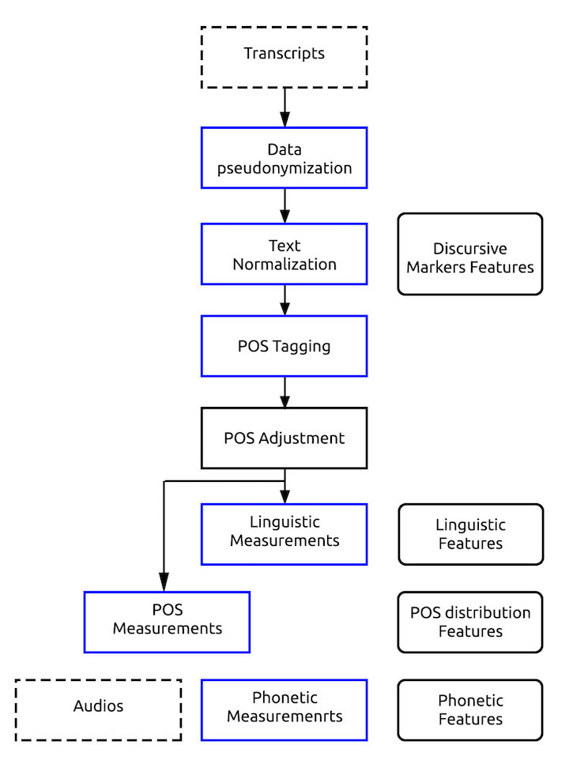

# usAge
This project consist in a series of modules used to extract measures from transcripts and audios of a given corpus. It is meant to be use for clinical evaluation and monitoring of patients but could eventually be used in a wider variety of applications as it is language and context independant in most parts of the pipeline.

The following figure presents the pipeline architecture of this measure extraction tool.

**Current language support : English, Spanish, German, French, and Portuguese** 




## Table of Contents
1. [Installation](#Installation)
    1. [Using Anaconda (Recommended)](#using-anaconda-(Recommended))
    2. [Using pip](#using-pip)
2. [Data preparation](#data-preparation) 
3. [How to use](#how-to-use)
    1. [TLDR](#TLDR)
    2. [multilingual-text-normalizer](#multilingual-text-normalizer)
    3. [multilingual-pos-tagger](#multilingual-pos-tagger)
    4. [pos-adjustment](#pos-adjustment)
    5. [multilingual-pos-distribution](#multilingual-pos-distribution)
    6. [multilingual-linguistic-measures](#multilingual-linguistic-measures)
    7. [multilingual-phonetic-measures](#multilingual-phonetic-measures)
4. [How it works](#how-it-works)

---

## Installation
In order to run this tool you will need to install python.

### Using Anaconda (Recommended)
1. [Install Anaconda](https://docs.anaconda.com/anaconda/install/)
2. Create environment & install dependencies :  
```
conda env create -n usAge -f usAge.yml
```
3. Activate environment :  
```
conda activate usAge
```
### Using pip
1. [Install pip](https://pip.pypa.io/en/stable/installing/)
2. Install virtualenv
```
pip install virtualenv
```
3. Create environment & activate :  
```
virtualenv usAgeVenv
source usAge/bin/activate # MAC
usAge\scripts\activate # Windows
```
4. Install dependencies :  
```
pip install -r requirements.txt
```
---

---

## Data preparation
Transcripts in corpus must be **.txt** or **.cha** format and must be named as following :

*Status_ParticipantNumber-InterviewNumber.extension*

Example : `CTRL_101-01.txt`

---

## How to use

### TLDR
---
Here's an example of the pipeline usage, step-by-step :

```
python src/pseudonymise-participants.py data/transcripts/ -v
```
```
python src/multilingual-text-normalizer.py data/transcripts/ 
                                           -s cfg-examples/en/synonym_en.cfg 
                                           -i cfg-examples/en/interjection_en.cfg 
                                           -e cfg-examples/en/expression_en.cfg
```
```
python src/multilingual-pos-tagger.py out/CleanedDialogs/PAR/SynonymReduced
                                      cfg-examples/en/freeling-en.cfg
                                      -u cfg-examples/universal_tagset-ES.map
```
```
python src/english-pos-adjustment.py out/TaggedDialogs/PAR/
```
```
python src/multilingual-pos-distribution.py out/TaggedDialogsAdjusted/PAR/
```
```
python src/multilingual-linguistic-measures.py out/TaggedDialogsAdjusted/PAR/
```
```
python src/multilingual-phonetic-measures.py data/audios/
```

And here's the output of all the process :

```
+-- out
|   +-- PseudonymisedInfo       # pseudonymised patients' information
|   +-- CleanedDialogs          # cleaned transcripts
|   +-- TaggedDialogs           # tagged transcripts
|   +-- TaggedDialogsAdjusted   # tagged and adjusted transcripts
|   +-- ExtractedMeasures       # all extracted measures (features)
```
### pseudonymise-participants
---

This module pseudonymise participants' information. Since we work with clinical transcripts, we want to make sure personnal information isn't visible in plain text.

Here's an example on how to run the text pseudonymiser tool :

```
python src/pseudonymise-participants.py data/transcripts/ -v
```

It will create an output folder with all the pseudonymised information. Here's the output folder structure :
```
+-- out
|   +-- PseudonymisedInfo       # pseudonymised patients' information
```

**Arguments**

`corpus_path`  
File path to the directory where the corpus is stored. The directory should only contain transcripts with one (or both) of the following format :  
- .txt
- .cha

**Optional Flags**

`--verbose (-v)`  
Prints debug output in console.

### multilingual-text-normalizer
---

The text normalizer tool is used to clean transcripts and extract discursive markers as it may contains valuable information on linguistic functions level. This tool does not depend on any language and/or context. 

**NOTICE**

Transcripts don't need discursive markers to be normalized but markers will help extract more measures on the discourse level. Refer to the [How it works](#how-it-works) section for more info on those markers.

Here's an example on how to run the text normalizer tool :

```
python src/multilingual-text-normalizer.py <corpus_path>
                                            -s <synonyms_conf_path>
                                            -i <interjections_conf_path>
                                            -e <expressions_conf_path>
```

It will create an output folder with all the normalized data and its measures. Here's the output folder structure :
```
+-- out
|   +-- CleanedDialogs    # cleaned transcripts
```

**Arguments**

`corpus_path`  
File path to the directory where the corpus is stored. The directory should only contain transcripts with one (or both) of the following format :  
- .txt
- .cha

**Optional Flags**

`--synonyms_conf_path (-s)`  
File path for synonym reducing task.

The file content should be in the following format in a **text** file :  
```
[reduced_synonym]      
synonym_1
synonym_2
synonym_3
...
```
*Example :*   
```
[girl]
little girl
young girl
sister
little sister
young sister

[boy]
little boy
young boy
brother
little brother
little sister
```

`--interjections_conf_path (-i)`  
File path for interjection removal task.

The file content should be in the following format in a **text** file :
```
interjection_1
interjection_2
interjection_3
...
```
*Example :*   
```
uhh
uhm
um
oh
ah
```

`--expressions_conf_path (-e)`  
File path for expression removal task.

The file content should be in the following format in a **text** file :  
```
expression_1
expression_2
expression_3
...
```
*Example :*  
```
laugh
sigh
cough
```

`--features_output_path (-f)`  
Output path where cleaning/normalizing features will be exported as a **.csv** file. 

`--verbose (-v)`  
Prints debug output in console.

### multilingual-pos-tagger
---
The multilingual POS tagger uses [FreeLing 4.0](https://freeling-user-manual.readthedocs.io/en/v4.0/installation/) to tag transcripts. If the universal mapping file is specified, most of POS tags will be converted to it's universal form. (**English, Spanish & French** tags are supported at the moment)

**NOTICE**

FreeLing 4.0 must be installed on your computer and set as an environment variable path in order to work as it calls the `analyze` command.

Here's an example on how to run the POS tagger tool :

```
python src/multilingual-pos-tagger.py <corpus_path>
                                       <freeling_config_path>
                                       -u <universal_map_path>
```

It will create an output folder with all the tagged data. Here's the output folder structure :
```
+-- out
|   +-- TaggedDialogs     # POS tagged transcripts
```

**Arguments**

`corpus_path`  
File path to the directory where the corpus is stored. The directory should only contain transcripts with the following format:  
- .txt

`freeling_config_path`  
File path to the FreeLing configuration. It is necessary in order to run FreeLing tool for POS tagging. Normally, a configuration file is defined for each languages.

**Optional Flags**

`--universal_map_path (-u)`  
File path for the universal mapping. It is used to universalize POS tags in order to bring them to a more simplified and language independant form. If this flag is not specified, no universalization will be done on the tags.  

There's a default map file in the **cfg-examples/** folder but you may create your own mapping file. The default mapping file supports **French, English, Spanish and Portuguese** at the moment. Here's the following format of the configuration **.txt** file :

```
POS_tag_1 Universal_tag_1
POS_tag_2 Universal_tag_2
...
```
*Example :*  
```
ao0fs0	ADJ
vag0000	AUX_VERB
...
```

`--verbose (-v)`  
Prints debug output in console.

### pos-adjustment
---
POS tags adjustment is the only process that isn't multilingual. It is part of an incremental work as it can be adjusted to any language and/or context. It helps fix FreeLing tagging errors or adjust/simplify some tags as desired. For now, we implemented the **English** and **French** POS tag adjusment for the Cookie Theft Picture description task.

Here's an example on how to run the POS tagger tool :

```
python src/english-pos-adjustment.py <corpus_path>
```

It will create an output folder with all the adjusted data. Here's the output folder structure :
```
+-- out
|   +-- AdjustedDialogs     # Adjusted POS tagged transcripts
```

**Arguments**

`corpus_path`  
File path to the directory where the **tagged** corpus is stored. The directory should only contain transcripts with the following format:  
- .txt

**Optional Flags**

`--verbose (-v)`  
Prints debug output in console.


### multilingual-pos-distribution
---
The multilingual POS distribution tool calculates measures of **frequencies** and **ratios** of POS tags.

**NOTICE**

POS tags should be universalized beforehand.

Here's an example on how to run the POS tagger tool :

```
python src/multilingual-pos-tagger.py <corpus_path>
```

**Arguments**

`corpus_path`  
File path to the directory where the **tagged & adjusted** corpus is stored. The directory should only contain transcripts with the following format:  
- .txt

**Optional Flags**

`--features_output_path (-f)`  
Output path where POS tags distribution features will be exported as a **.csv** file. 

`--verbose (-v)`  
Prints debug output in console.

### multilingual-linguistic-measures
---
The multilingual linguistic measures tool calculates linguistic metrics of a POS tagged transcript.

Note : This module supports only **English, Spanish, German, French, and Portuguese**, because it is limited by its usage of the library [PySpellChecker](https://pypi.org/project/pyspellchecker/).

Here's an example on how to run the linguistic measures tool :

```
python src/multilingual-linguistic-measures.py <corpus_path>
                                                en_CA
```

**Arguments**

`corpus_path`  
File path to the directory where the **tagged & adjusted** corpus is stored. The directory should only contain transcripts with the following format:  
- .txt

`language`  
The language of the transcription you want to process, as it uses a dictionnary to evaluate words existence. Find the supported languages [here](https://abiword.github.io/enchant/).
(e.g.: en_CA, fr_CA, etc.)

**Optional Flags**

`--features_output_path (-f)`  
Output path where linguistic features will be exported as a **.csv** file. 

`--verbose (-v)`  
Prints debug output in console.

### multilingual-phonetic-measures
---
The multilingual phonetic measures tool calculates phonetic metrics of audio signal.

Here's an example on how to run the phonetic measures tool :

```
python src/multilingual-phonetic-measures.py <audio_corpus_path>
```

**Arguments**

`corpus_path`  
File path to the directory where **audio** files are stored. The directory should only contain audios with the following format:  
- .mp3
- .wav

**Optional Flags**

`--features_output_path (-f)`  
Output path where phonetic features will be exported as a **.csv** file. 

`--verbose (-v)`  
Prints debug output in console.

## How it works

### multilingual-text-normalizer
---
This tool is based on a pipeline architecture. It seperates small normalizing/cleaning tasks as subprocesses and executes them one after the other. Here are the following tasks performered on a transcript :

1. [Extract pauses](#extract-pauses)
2. [Remove parantheses](#remove-parantheses)
3. [Extract interjections](#extract-interjections)
4. [Extract expressions](#extract-expressions)
5. [Extract incomplete words](#extract-incomplete-words)
6. [Extract incomplete phrases](#extract-incomplete-phrases)
7. [Extract errors](#extract-errors)
8. [Extract repetitions](#extract-repetitions)
9. [Extract retracings](#extract-retracings)
10. [Remove markers & symbols](#remove-markers-and-symbols)
11. [Reduce synonyms](#reduce-synonyms)
12. [Normalize sentences](#normalize-sentences)

#### Extract pauses
Pauses should be marked as following :
```
(.) # small pause
(..) # medium pause
(...) # long pause
(....+) # other pause
```

#### Remove parantheses
This process simply removes parantheses from transcripts.

#### Extract interjections
Interjections should be marked as following :
```
&-<interjection> # example: &-uhm
```
or
```
&=<interjection> # example: &=uhm 
```

#### Extract expressions
Expressions should be marked as following :
```
&=<expressions> # example: &=laugh
```

#### Extract incomplete words
Incomplete words should be marked as following :
```
&<incomplete_word>  # example: &incompl
```
or
```
&+<incomplete_word> # example: &+incompl
```

#### Extract incomplete phrases
Incomplete phrases finishes by 3 commas. It is replaced by a single comma.

#### Extract errors
Errors should be marked as following :

**Single word**
```
... wrong_word [: correct_word] [*]...  # example: He had two mouses [: mice] [*].
```

**Multiple words**
```
... <decomposed_word> [: composed_word]... [*] # It's beautiful <out side> [: outside]. [*]
```

#### Extract repetitions
Repetitions should be marked as following :

**Multiple words**
```
... <repeated_POS> [/] repeated_POS...
# example : <I wanted> [/] I wanted to invite Margie.
```

**Single words**
```
... repeated_word [/] repeated_word...
# example : It's [/] it's like a dog.  
```

or
```
... repeated_POS, reapeated POS...
# example The car, the car is parked.
```

#### Extract retracings
Retractings should be marked as following :

**Multiple words**
```
... <wrong_pos> [//] good_pos...
# example : <I wanted> [//] uh I thought I wanted to invite my friend.
```

**Single word**
```
... <wrong_word> [//] good_word...
# example : I [//] uh I thought I wanted to invite my friend.
```

#### Remove markers and symbols
Multiple markers and symbols are removed to clean out noisy data from transcripts.

#### Reduce synonyms
Synonym reduction is explained [here](#synonyms).

#### Normalize sentences
Normalizing sentences will apply a capital letter at the begenning of the sentence and a comma at the end of it.

### multilingual-pos-tagger
---
This tool calls FreeLing `analyze` tool to annotate transcription's words with POS tags.

Optionnaly, you can universalize POS tags by passing a universalize mapping file.

### pos-adjustment
---
This tool is adapted to language and/or context. It is used to fix FreeLing tags or adjust some tags as desired.

### multilingual-pos-distribution
---
This tool evaluates the following POS tags **frequency** and **ratio** in transcripts :

- ADJ
- CONJ
- NOUN
- ADP
- VERB
- AUX_VERB

### multilingual-lingustic-measures
---
This tool evaluates the following linguistic metrics :

- Text size
- Vocabulary size
- Hapax legomena
- Hapax dislegomena
- Brunet's W index
- Honoré's R statistics
- Type Token Ratio (TTR)
- Sichel's S
- Yule's K
- Entropy

### multilingual-phonetic-measures
---
This tool evaluates the first 13 MFCCs following metrics :

- Mean
- Skewness
- Kurtosis
- Variance

